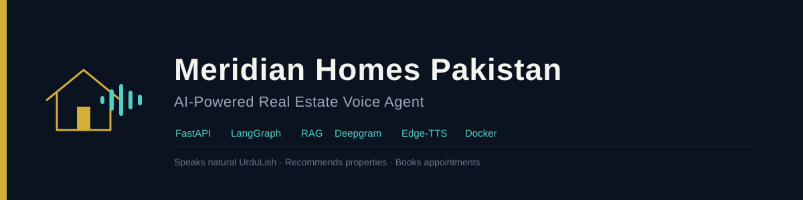

A production-oriented AI voice agent for real estate businesses. The system can communicate with customers in natural UrduLish, understand their property requirements, search a real estate knowledge base, recommend suitable properties, handle common objections, collect customer information, and manage appointments.

The project is designed as a modular voice-agent backend with FastAPI, LangGraph, RAG, hosted AI services, business automation, and Docker-based deployment.

---

## 1. Project Overview

The goal of this project is to simulate a real estate sales representative that can handle customer conversations from the initial greeting through property discovery and appointment scheduling.

The agent is designed to:

- Speak naturally in Pakistani UrduLish
- Understand Urdu, English, and mixed Urdu-English speech
- Extract customer preferences such as:
  - Budget
  - City
  - Area
  - Property type
  - Number of bedrooms
  - Purpose of purchase
- Search the company's property and business knowledge base
- Recommend relevant properties
- Answer property-related questions using grounded information
- Handle common customer objections
- Maintain conversation context
- Book appointments
- Reschedule appointments
- Cancel appointments
- Send appointment-related emails
- Store customer information in the CRM/database
- Run inside a Docker container
- Expose a FastAPI backend for integration with external voice platforms

---

## 2. High-Level Architecture

```text
                         CUSTOMER
                            │
                            ▼
                    Voice Interface
                  (Vapi in production)
                            │
                            ▼
                    Speech-to-Text
                       Deepgram
                            │
                            ▼
                    FastAPI Application
                            │
                            ▼
                     LangGraph Agent
                            │
              ┌─────────────┼─────────────┐
              │             │             │
              ▼             ▼             ▼
        Intent Detection   Memory        RAG
              │             │             │
              │             │             ▼
              │             │       Property Knowledge
              │             │             │
              │             │             ▼
              │             │       ChromaDB + SQLite
              │             │
              └─────────────┼─────────────┐
                            │             │
                            ▼             ▼
                    Business Tools   Recommendations
                            │
            ┌───────────────┼────────────────┐
            │               │                │
            ▼               ▼                ▼
       Google Calendar     Email            CRM
            │               │                │
            └───────────────┼────────────────┘
                            │
                            ▼
                      Response Generation
                            │
                            ▼
                         TTS
                       Edge-TTS
                            │
                            ▼
                      Voice Response
                            │
                            ▼
                         CUSTOMER
```

---

## 3. Core Technology Stack

| Component                 | Technology                         |
| -------------------------- | ----------------------------------- |
| Backend                   | FastAPI                            |
| Agent orchestration       | LangGraph                          |
| LLM                       | OpenAI-compatible API / OpenRouter |
| Speech-to-Text            | Deepgram                           |
| Text-to-Speech            | Edge-TTS                           |
| Voice interface           | Vapi for production                |
| Development voice testing | LiveKit                            |
| RAG                       | LangChain + ChromaDB               |
| Embeddings                | Sentence Transformers              |
| Embedding model           | `all-MiniLM-L6-v2`                 |
| Database                  | SQLite                             |
| CRM                       | Local database / CRM tools         |
| Calendar                  | Google Calendar API                |
| Email                     | SMTP / Resend integration          |
| Containerization          | Docker                             |
| Server                    | Uvicorn                            |
| Language                  | Python 3.12                        |

---

## 4. Conversation Flow

The agent follows a structured conversation pipeline rather than sending every user message directly to an LLM.

A typical conversation looks like:

```text
Customer calls
     │
     ▼
Greeting
     │
     ▼
Understand customer intent
     │
     ├── Property search
     │
     ├── General question
     │
     ├── Booking
     │
     ├── Rescheduling
     │
     ├── Cancellation
     │
     └── Goodbye
     │
     ▼
Collect relevant information
     │
     ▼
Search knowledge/property database
     │
     ▼
Recommend suitable properties
     │
     ▼
Answer questions / objections
     │
     ▼
Customer requests appointment
     │
     ▼
Collect:
     - Name
     - Phone number
     - Date
     - Time
     - Property
     │
     ▼
Check availability
     │
     ▼
Create appointment
     │
     ├── Google Calendar
     ├── CRM
     └── Notification email
     │
     ▼
Confirm only after successful tool execution
     │
     ▼
Voice response
```

---

## 5. UrduLish Voice Persona

The agent is designed for Pakistani real estate conversations.

The conversational style is:

- Professional
- Friendly
- Warm
- Patient
- Persuasive without being aggressive
- Natural Pakistani UrduLish

Example:

```text
Assalam-o-Alaikum! Main Ahmed baat kar raha hoon
Meridian Homes Pakistan se. Aap ko kis property
mein interest hai?
```

The system supports mixed language conversations such as:

```text
Mujhe Lahore mein apartment chahiye,
budget around 3 crore hai.
```

The agent should understand both the English and Urdu components and maintain the same conversational context.

---

## 6. LangGraph Agent

LangGraph is responsible for controlling the agent's decision-making flow.

The graph contains specialized stages/nodes for tasks such as:

```text
Greeting
   ↓
Intent Detection
   ↓
Preference / Slot Extraction
   ↓
RAG / Property Search
   ↓
Recommendation
   ↓
Objection Handling
   ↓
Appointment Handling
   ↓
Response Generation
```

Appointment-related flows are separated into:

```text
Booking
Rescheduling
Cancellation
Availability checking
```

This separation allows business actions to be handled deterministically instead of relying entirely on the LLM.

---

## 7. Conversation Memory

The agent maintains structured customer information throughout a conversation.

Examples include:

```text
Budget
City
Area
Property type
Bedrooms
Purpose
Client name
Phone number
Appointment date
Appointment time
Selected property
```

The system distinguishes structured customer state from raw conversational history.

This prevents a customer's previously collected information from being unnecessarily lost between turns.

---

## 8. Retrieval-Augmented Generation (RAG)

The agent uses RAG to ground property-related responses in the company's knowledge base.

The knowledge base can contain information about:

```text
Properties
Prices
Locations
Developers
Amenities
Payment plans
FAQs
Company information
Guides
```

The RAG pipeline works approximately as follows:

```text
Knowledge Documents
       │
       ▼
Document Loading
       │
       ▼
Text Chunking
       │
       ▼
Sentence Transformer
       │
       ▼
Embeddings
       │
       ▼
ChromaDB
       │
       ▼
Similarity Search
       │
       ▼
Relevant Context
       │
       ▼
LLM Response
```

The embedding model used is:

```text
all-MiniLM-L6-v2
```

The local vector database allows property information to be retrieved without sending the entire knowledge base to the LLM.

---

## 9. Property Recommendation

The recommendation system uses customer preferences to identify relevant properties.

For example:

```text
Customer:
"I need a 2 bedroom apartment in Lahore.
My budget is around 3 crore."

        ↓

Extract preferences

        ↓

Search property database

        ↓

Find matching properties

        ↓

Return relevant recommendations

        ↓

Generate UrduLish response
```

The agent should not claim that a property exists or has a specific feature unless the information is available in the application's property/knowledge data.

---

## 10. Appointment Automation

The agent can handle:

### Booking

```text
Customer requests appointment
        ↓
Collect name
        ↓
Collect phone number
        ↓
Collect property
        ↓
Collect date
        ↓
Collect time
        ↓
Check availability
        ↓
Book appointment
        ↓
Update CRM
        ↓
Send notification
        ↓
Confirm booking
```

### Rescheduling

```text
Existing appointment
        ↓
New date/time requested
        ↓
Availability check
        ↓
Calendar update
        ↓
CRM update
        ↓
Confirmation
```

### Cancellation

```text
Cancellation request
        ↓
Find appointment
        ↓
Cancel calendar event
        ↓
Update CRM
        ↓
Send notification
        ↓
Confirmation
```

A key safety rule is:

> The agent must not claim that an appointment was successfully booked, rescheduled, or cancelled unless the corresponding business operation actually succeeds.

---

## 11. Google Calendar Integration

Google Calendar is used for appointment management.

The application uses:

```text
credentials.json
token.json
```

These files are sensitive and must never be committed to Git or baked into the Docker image.

For Docker deployment they are mounted into the container at runtime.

---

## 12. Email Automation

Appointment-related emails can be sent through the configured email provider.

Typical events include:

```text
Appointment booked
Appointment rescheduled
Appointment cancelled
```

Email credentials are supplied through environment variables rather than hard-coded in the application.

---

## 13. CRM

Customer and appointment information is stored through the project's CRM/database layer.

The CRM can maintain information such as:

```text
Customer name
Phone number
Property interest
Budget
Location
Appointment information
Conversation-related data
```

This allows the voice agent to behave more like a business assistant rather than simply a conversational chatbot.

---

## 14. Voice Pipeline

The voice pipeline is split into independent components.

```text
Customer Speech
      │
      ▼
Deepgram STT
      │
      ▼
LangGraph Agent
      │
      ├── Memory
      ├── Intent
      ├── RAG
      ├── Recommendations
      └── Business Tools
      │
      ▼
Generated Text
      │
      ▼
Edge-TTS
      │
      ▼
Spoken Response
```

Deepgram handles speech recognition.

Edge-TTS handles speech synthesis.

The LLM handles language understanding and response generation.

---

## 15. Production Voice Integration

The application backend is designed to be connected to an external voice platform.

For production, the planned voice interface is:

```text
Vapi
```

LiveKit was used during development and testing of the voice-agent pipeline.

The LiveKit implementation can remain in the repository for development/testing purposes without being required for the production deployment.

---

## 16. API Backend

The FastAPI application is started through Uvicorn.

The Docker container exposes:

```text
8000
```

The application includes a health endpoint:

```text
GET /health
```

Local health check:

```text
http://localhost:8000/health
```

The health endpoint is intentionally lightweight and does not require external AI services to respond successfully.

---

## 17. Project Structure

A simplified project structure is:

```text
real-estate-voice-agent/
│
├── app/
│   ├── api/
│   ├── calendar/
│   ├── config.py
│   ├── crm/
│   ├── email/
│   ├── graph/
│   ├── livekit_worker/
│   ├── llm/
│   ├── rag/
│   ├── recommendation/
│   ├── tools/
│   ├── voice/
│   ├── workflows/
│   ├── monitoring.py
│   └── main.py
│
├── database/
│
├── evaluation/
│
├── sample_audio/
│
├── test_output/
│
├── Dockerfile
├── docker-compose.yml
├── requirements.txt
├── .dockerignore
├── .gitignore
├── .env
├── credentials.json
└── token.json
```

Some directories such as `sample_audio`, `test_output`, logs, caches, and local databases are development/runtime artifacts and are excluded from the Docker image where appropriate.

---

## 18. Environment Variables

Create a `.env` file in the project root.

It contains configuration such as:

```env
OPENAI_API_KEY=your_key
OPENAI_BASE_URL=your_provider_url
OPENAI_MODEL=your_model

DEEPGRAM_API_KEY=your_key
DEEPGRAM_MODEL=nova-3
DEEPGRAM_LANGUAGE=ur

EDGE_TTS_VOICE=ur-PK-AsadNeural
EDGE_TTS_RATE=+0%

GOOGLE_CALENDAR_ID=primary
CALENDAR_TIMEZONE=Asia/Karachi

SMTP_HOST=your_smtp_host
SMTP_PORT=587
SMTP_USERNAME=your_email
SMTP_PASSWORD=your_password
SMTP_FROM_EMAIL=your_from_email
SMTP_USE_TLS=true

# Additional application configuration
# as required by app/config.py
```

Never commit the real `.env` file.

A safe `.env.example` should contain only variable names and placeholder/default values.

---

## 19. Security

The following files contain secrets or authentication credentials:

```text
.env
credentials.json
token.json
```

They should never be committed to Git.

They are excluded from the Docker image through `.dockerignore`.

They are supplied to the application at runtime.

The Docker image therefore does not contain the project's private credentials.

---

## 20. Docker Deployment

The project includes a Dockerfile based on:

```text
python:3.12-slim
```

The Docker image installs the Python dependencies and copies the application into the container.

The project uses CPU-only PyTorch because local machine-learning inference is limited to embedding generation. Speech recognition, text-to-speech, and LLM inference use hosted services and require the container to have outbound network access at runtime.

The `all-MiniLM-L6-v2` embedding model is downloaded and cached in the image at build time, so the container does not need to reach Hugging Face at startup — this is separate from the network access still required for Deepgram, the LLM provider, SMTP, Google Calendar, and (in production) Vapi.

Build the image:

```bash
docker build -t real-estate-voice-agent:latest .
```

---

## 21. Running with Docker Compose

The project includes:

```text
docker-compose.yml
```

Build and start:

```bash
docker compose up --build
```

Run in the background:

```bash
docker compose up -d
```

View logs:

```bash
docker compose logs -f
```

Stop the application:

```bash
docker compose down
```

The application will be available at:

```text
http://localhost:8000
```

Health check:

```text
http://localhost:8000/health
```

---

## 22. Running with Plain Docker

The Docker image can also be started without Compose.

### Build

```bash
docker build -t real-estate-voice-agent:latest .
```

### Run on Windows CMD

```cmd
docker run --rm -p 8000:8000 --env-file .env ^
  -v "%cd%\credentials.json:/app/credentials.json:ro" ^
  -v "%cd%\token.json:/app/token.json:ro" ^
  real-estate-voice-agent:latest
```

### Run as a single line

```cmd
docker run --rm -p 8000:8000 --env-file .env -v "%cd%\credentials.json:/app/credentials.json:ro" -v "%cd%\token.json:/app/token.json:ro" real-estate-voice-agent:latest
```

The `:ro` flag mounts the Google credential files as read-only.

---

## 23. Testing the Container

After starting the container, verify the health endpoint:

```text
http://localhost:8000/health
```

You can also test from another terminal:

```bash
curl http://localhost:8000/health
```

Check that the application starts without import errors and that the RAG pipeline initializes correctly.

Expected startup behavior includes loading the embedding model and loading the existing vector database.

---

## 24. RAG Initialization in a New Environment

On a new deployment, the application may need to initialize its local data stores.

The startup flow is approximately:

```text
Application starts
       │
       ▼
SQLite database check
       │
       ▼
RAG vector store check
       │
       ├── Existing ChromaDB
       │       └── Load existing store
       │
       └── Missing ChromaDB
               └── Build vector store
```

The `all-MiniLM-L6-v2` embedding model is loaded when required.

The resulting local vector database is used for subsequent RAG queries.

---

## 25. Development Without Docker

For local development, activate the Python virtual environment and run:

```bash
python -m uvicorn app.main:app --port 8000 --reload
```

Using:

```bash
python -m uvicorn
```

is recommended on Windows because it avoids issues caused by stale or incorrectly configured `uvicorn.exe` launchers.

---

## 26. Testing

The repository contains tests and development utilities under:

```text
app/tests/
evaluation/
```

Voice components can also be tested independently where applicable.

Important areas to test include:

- Intent detection
- Conversation memory
- Slot extraction
- RAG retrieval
- Property recommendations
- Appointment booking
- Appointment rescheduling
- Appointment cancellation
- Calendar integration
- Email integration
- CRM updates
- Voice STT/TTS
- API health
- Docker startup

---

## 27. Important Agent Safety Rules

The agent should follow several important business rules.

### Property information

Do not invent:

- Property names
- Prices
- Locations
- Amenities
- Payment plans
- Availability

If the required information cannot be found, the agent should say so rather than fabricate an answer.

### Appointments

Never claim an appointment was:

- Booked
- Rescheduled
- Cancelled

unless the corresponding business tool successfully completed the operation.

### Customer information

Do not invent:

- Customer names
- Phone numbers
- Appointment times
- Customer preferences

Only use information actually provided by the customer or retrieved from trusted application state.

---

## 28. Current System Flow

The complete system can be summarized as:

```text
                    CUSTOMER
                       │
                       ▼
                Vapi / Voice UI
                       │
                       ▼
                 Deepgram STT
                       │
                       ▼
                FastAPI Backend
                       │
                       ▼
                 LangGraph
                       │
        ┌──────────────┼──────────────┐
        │              │              │
        ▼              ▼              ▼
      Intent         Memory           RAG
        │              │              │
        │              │              ▼
        │              │         Property Search
        │              │              │
        └──────────────┼──────────────┘
                       │
                       ▼
                Recommendation
                       │
                       ▼
               Objection Handling
                       │
                       ▼
             Appointment Workflow
                       │
          ┌────────────┼────────────┐
          ▼            ▼            ▼
       Calendar       CRM         Email
          │            │            │
          └────────────┼────────────┘
                       │
                       ▼
                Response Generation
                       │
                       ▼
                   Edge-TTS
                       │
                       ▼
                 Customer Voice
```

---

## 29. Deployment Philosophy

The system separates:

### Application logic

```text
FastAPI
LangGraph
RAG
Recommendation
Business tools
CRM
```

from:

### External services

```text
Deepgram
LLM provider
Edge-TTS
Google Calendar
Email provider
Vapi
```

and:

### Runtime secrets

```text
.env
credentials.json
token.json
```

This makes the application easier to move between development, Docker, and production environments without modifying the core application code.

---

## 30. Future Improvements

Potential future improvements include:

- Production Vapi integration
- More robust multilingual speech handling
- Improved Pakistani Urdu TTS quality
- Streaming response optimization
- Persistent conversation memory
- Production-grade PostgreSQL CRM
- Cloud-hosted vector database
- Better appointment conflict handling
- Advanced property ranking
- Authentication and authorization
- Monitoring and observability
- Automated evaluation of hallucination rate
- Improved fallback handling for unreliable LLM responses
- Production deployment on a cloud platform

---

## 31. Summary

Meridian Homes Pakistan is an AI-powered real estate voice-agent backend that combines:

```text
Voice AI
+
LLM
+
LangGraph
+
RAG
+
Property Recommendation
+
Conversation Memory
+
Google Calendar
+
CRM
+
Email Automation
+
FastAPI
+
Docker
```

The result is a conversational real estate assistant capable of moving beyond simple question answering and performing real business workflows such as property discovery and appointment management.

The application can be run locally for development or packaged as a Docker container for deployment.

